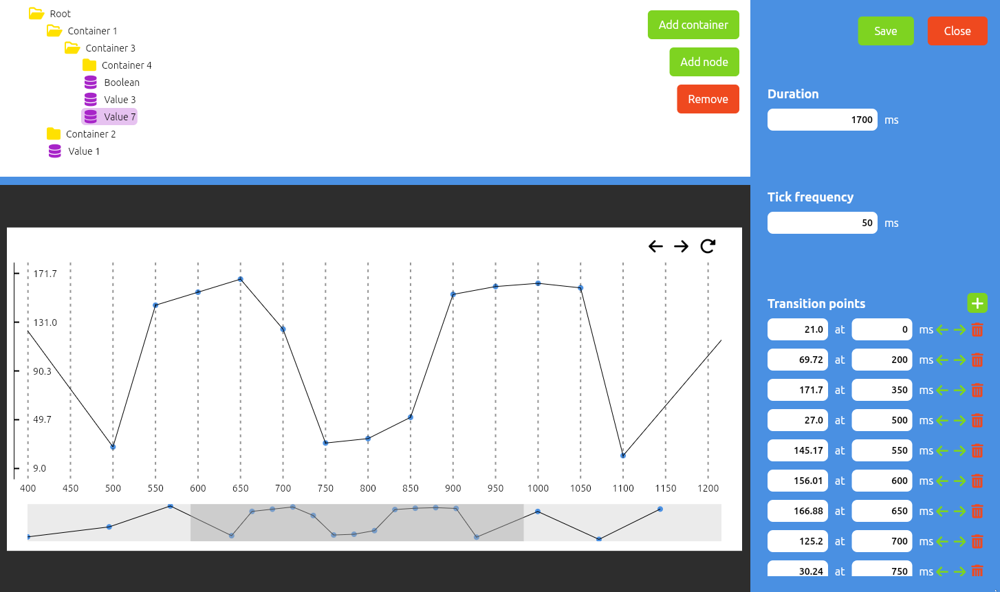

# Waveform designer

## What is this project about?

This project offers an intuitive user interface for designing and defining the structure of simulated OPC UA server. It allows you to define the evolution of values of nodes over time.

## How

It allows the creation & organization of value nodes.

An interactive plot is provided, enabling the definition of value transition points by clicking on the desired tick. For greater precision, transition points can also be defined manually.

The project can be saved for easy sharing and later editing. It can also be directly imported into [OPC Node simulator](https://github.com/AndreiLacatos-works/opc-engine) to simulate an OPC UA server according to the node structure defined here.



## Installation

### Linux

On `debian` based systems install the utility via the provided `.deb` package:

```sh
dpkg -i opc_node_designer-<version>.deb
```

### Windows

Install the utility via the provided installer.

```ps
waveform-designer-<version>.exe
```

Ensure that the system has the latest Visual C++ Redistributables installed.
