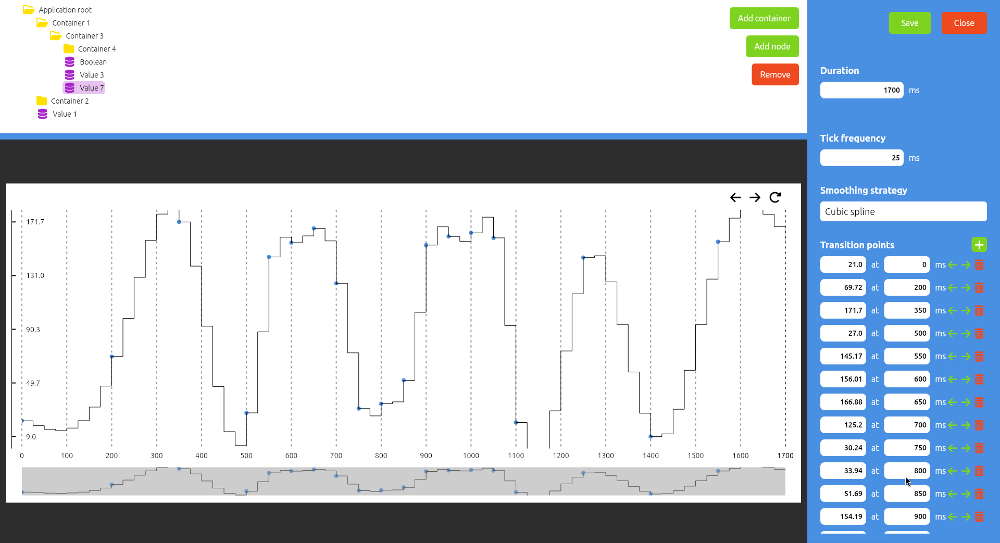

# Waveform designer

## What is this project about?

This project offers an intuitive user interface for designing and defining digital signal waveforms.

## How

An interactive signal plot is provided, enabling users to create transition points by clicking on the desired tick. For greater precision, transition points can also be defined manually.

Waveforms are saved and exported in a JSON format. These exported files enable easy sharing and allow waveforms to be edited later.



## Installation

### Linux

On `debian` based systems install the utility via the provided `.deb` package:

```sh
dpkg -i waveform_designer-<version>.deb
```

### Windows

Install the utility via the provided installer.

```ps
waveform-designer-<version>.exe
```

Ensure that the system has the latest Visual C++ Redistributables installed.
